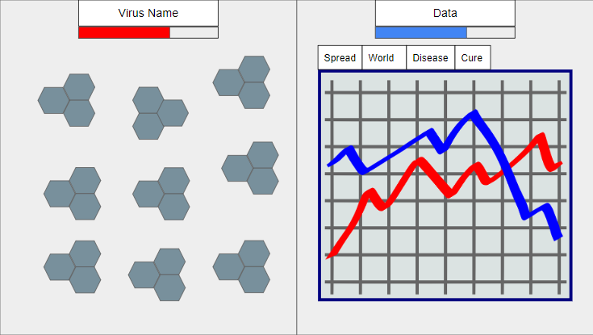

# OOGA Wireframe
### Team Plague Inc.
### Eka Ebong, Diego Miranda, Anika Mitra, Eloise Sinwell, Kevin Tu, Jerry Worthy

### HOME UI

This image shows the wireframe we will base the design of our home UI on.

### POP-UPS

This image shows the wireframe we will base the design of our pop-ups on, the left side
shows the pop-up for the evolution of the virus with the perk trees while the right side shows
the different ways the data can be viewed.

### ERRONEOUS SITUATIONS
Unrecognized factors in the config files will be reported to the user via a dialog box that pops
up, this would result if any of the factor names across the config files fail to match. A message
that tells the user the map setup file is formatted incorrectly will also appear. Most exceptions
would come from issues with the config files. This also includes improper format of the region
files, such as regions having paths to countries with ID's that do not exist, or having borders that extend
beyond the reach of the map. Missing key information from both the region config files or the actor config 
file will also result in an error, such as the actor not having a modifier for a factor that the region has or
the opposite. 